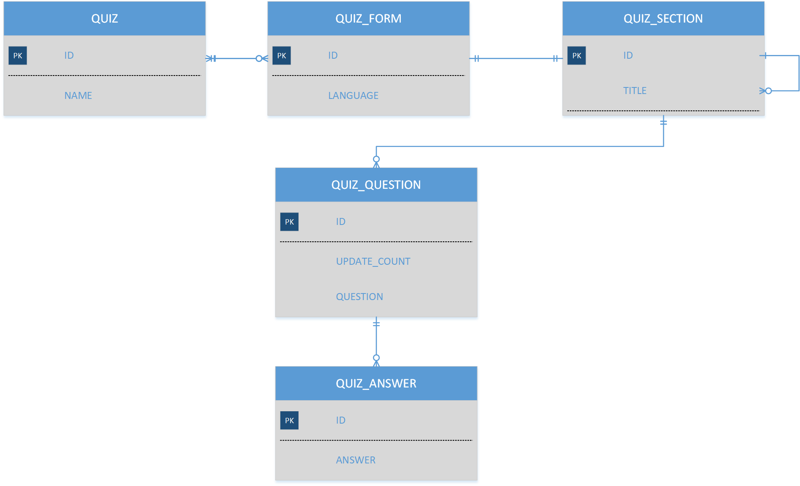

Please do following:

1. Fork repository 
1. Change source code to make `MultipleUsersTest` pass
1. Change source code to make `AllQuestionsValidTest` pass
1. Introduce new entity(ies) relevant to `QuizForm` and `QuizSection` according to ER diagram below
1. Introduce new REST API to perform basic CRUD operations with `QuizForms`. API should: 
   1.  Return all `QuizForms` by `Quiz` ID
   1. `QuizForms` should have all `QuizSections`, `QuizQuestions` and filled `QuizAnswers`
   1. API should allow answering`QuizQuestion` in context of the `QuizForm` 
1. Write unit and integration tests for newly created classes.
1. Refactor project code and tests to your liking and best effort. Focus on `QuizController` and `QuizService`.
1. Create new Angular app. UI should provide all functionality supported by REST API. Feel free to design/define your own UI and UX.
1. Prepare and submit pull request

If needed, please ask clarification questions.

Try to do every step as a separate commit. 

*ER Diagram*

